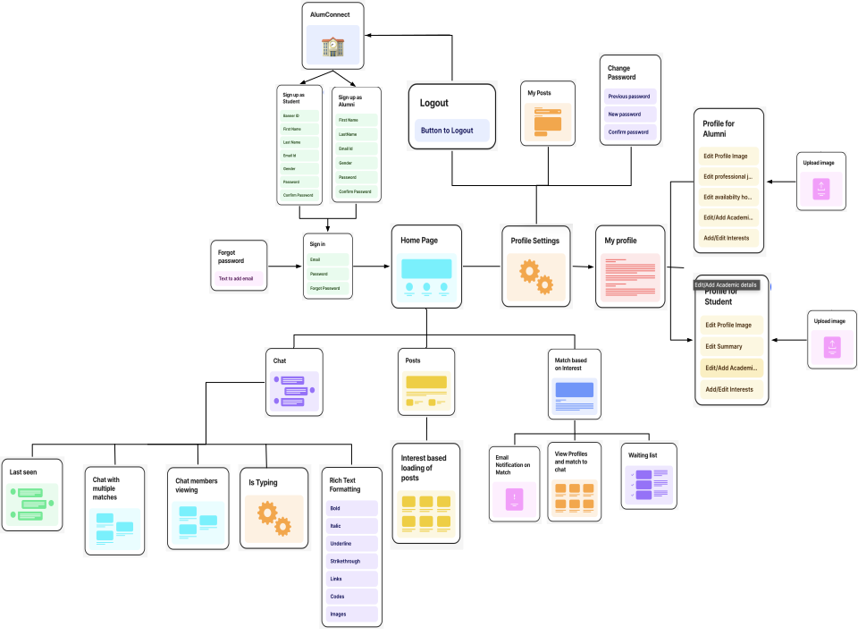
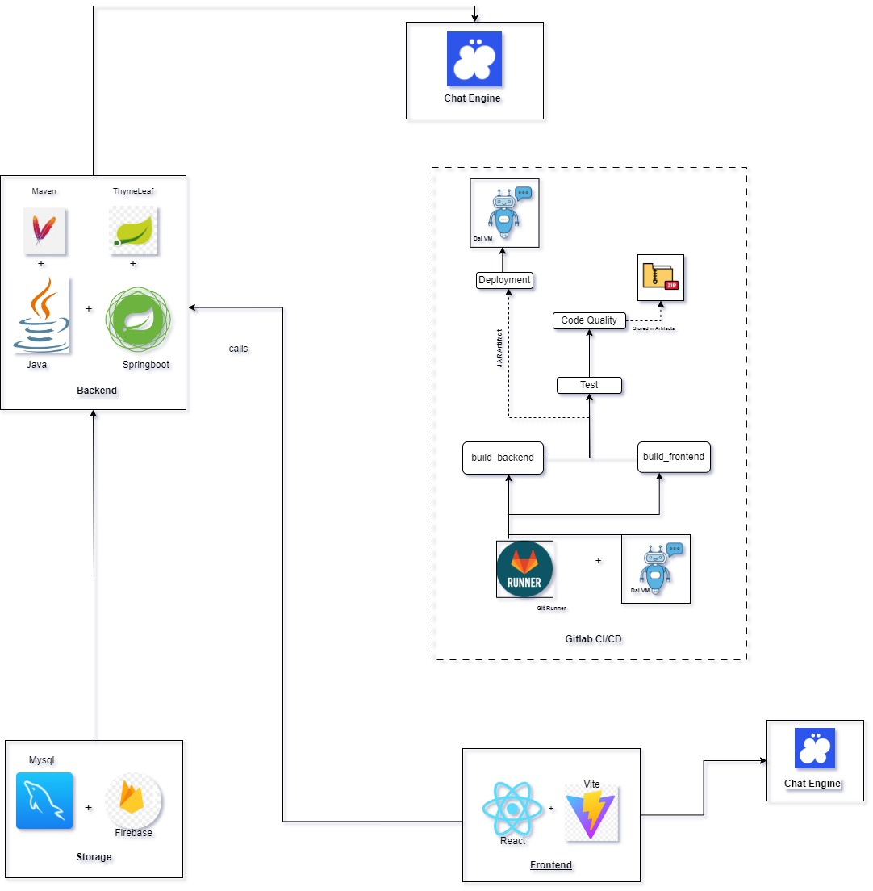
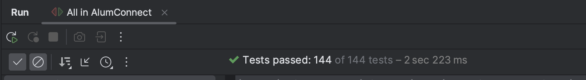
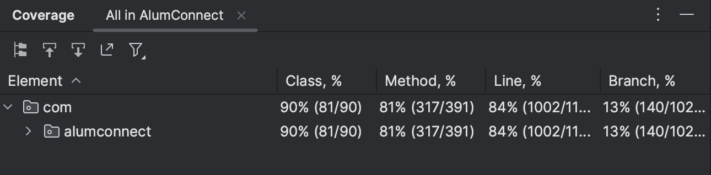

# AlumConnect


AlumConnect is a web application used to foster connections between the alumni and students of Dalhousie University. The application allows users to match with each other based on common interests facilitating networking,mentorship and community building within the university ecosystem. 

## OVERVIEW
At AlumConnect, we aim to empower individuals within the Dalhousie University community to forge connections based on shared experiences, interests, and aspirations.
Whether you are a recent graduate navigating through the early stages of your career or a seasoned professional eager to give back to the Dalhousie Community, our platform provides the resources to facilitate these invaluable connections.

## **TABLE OF CONTENTS**
1. [AlumConnect - Backend Setup](#alumconnect---backend-setup)
    - [Libraries Used](#libraries-used)
    - [Prerequisites](#prerequisites)
    - [Getting Started](#getting-started)
    - [References of technologies used](#references-of-technologies-used)

2. [AlumConnect - UI Setup](#alumconnect---ui-setup)
    - [Libraries Used](#libraries-used)
    - [Prerequisites](#prerequisites-1)
    - [Getting Started](#getting-started-1)
    - [Commands](#commands)
    - [References of technologies used](#references-of-technologies-used-1)
    
3. [Features](#features)
4. [App Development Flow](#app-development-flow)
5. [Usage Scenario](#usage-scenario)
6. [Detailed Usage Scenario](#detailed-usage-scenario)
7. [Build and Deployment Instructions](#build-and-deployment-instructions)
8. [Tests](#tests)
9. [Code Quality](#code-quality)
10. [License](#license)
11. [Contribution](#contribution)

## **AlumConnect - Backend Setup**
## **Libraries Used**

- Spring Boot Starter Data JPA: `v3.1.4`
- Spring Boot Starter Security: `v3.1.4`
- Spring Boot Starter Web: `v3.1.4`
- MySQL Connector/J: `v8.0.33`
- Lombok: `v1.18.20.0`
- Spring Boot Starter Test: `v3.1.4`
- Spring Security Test: `6.2.3`
- Mockito Core: `5.11.0`
- JWT API: `v0.11.5`
- JWT Implementation: `v0.11.5`
- JWT Jackson: `v0.11.5`
- Annotations: `v24.0.0`
- Spring Boot Starter Mail: `3.2.4`
- MapStruct Processor: `v1.3.1.FINAL`
- JUnit: `4.13.2`
- Firebase Admin: `v9.0.0`
- Thymeleaf Spring 5: `v3.1.2.RELEASE`
- JSON: `v20240303`
- OkHttp: `v4.9.1`
- Commons IO: `v2.11.0`
- Greenmail Spring: `v1.6.5`

## Prerequisites

- JDK: `v17`
- Maven: `v4.0.0`

## Getting Started

To get a local copy of the project up and running, follow the steps illustrated below.

### 1. Clone the Repository
```bash
 git clone https://git.cs.dal.ca/courses/2024-winter/csci5308/Group05.git
```
### 2. Navigate to the project directory
```bash
cd Group05/Backend/AlumConnect
```
### 3. Build the project
```bash
mvn clean install
```
### 4. Deploy the application
```bash
mvn package 
```
### 5. Run the application
```bash
mvn spring-boot:run
```

The application will be accessible at `http://172.17.1.31:8080`.

## **AlumConnect - Frontend Setup**
## **Libraries Used**
- @heroicons/react: `v2.1.1`
- @react-spring/web: `v9.5.5`
- autoprefixer: `v10.4.18`
- axios: `v1.6.7`
- create-vite: `v5.2.0`
- postcss: `v8.4.35`
- react: `v18.2.0`
- react-chat-engine: `v1.11.28`
- react-dom: `v18.2.0`
- react-router-dom: `v6.22.0`
- react-select: `v5.8.0`
- react-tag-autocomplete: `v7.2.0`
- tailwindcss: `v3.4.1`
- react-hot-toast: `v2.4.1`

## Prerequisites
- Node.js `16.14.0`
- npm `8.3.0`
- Yarn `3.1.1`

## Development Dependencies
- @rollup/plugin-replace: `v5.0.5`
- @types/react: `v18.2.55`
- @types/react-dom: `v18.2.19`
- @vitejs/plugin-react: `v4.2.1`
- daisyui: `v4.7.2`
- eslint: `v8.56.0`
- eslint-plugin-react: `v7.33.2`
- eslint-plugin-react-hooks: `v4.6.0`
- eslint-plugin-react-refresh: `v0.4.5`
- prettier: `v3.2.5`
- vite: `v5.1.0`

## Reference of technologies used

- [React](https://react.dev/)
- [React Router](https://reactrouter.com/en/main)
- [Typescript](https://www.typescriptlang.org/)
- [Vite](https://vitejs.dev/)
- [Tailwind](https://tailwindcss.com/)
- [LessCSS](https://lesscss.org/)
- [Antd](https://ant.design/)

## Getting Started

To get a local copy of the project up and running, follow the steps illustrated below.

### 1. Clone the Repository
```bash
 git clone https://git.cs.dal.ca/courses/2024-winter/csci5308/Group05.git
```
### 2. Navigate to the project directory
```bash
cd Group05/Frontend/AlumConnect
```
### 3. Install Dependencies
```bash
npm install
```
### 4. Start development server
```bash
npm run dev 
```

The application will be accessible at `http://172.17.1.31:5173`

# Features

- **Interest Based Profile Matching:** Allows individuals to connect based on common interests between them.

- **Chat Feature:** Individuals can connect in realtime and chat with multiple users with the presence of rich text formatting.

- **Posts based on Interests:** Based on the interests provided by the user, they will be able to view posts that will be catered according to their interests.

- **Secure User Accounts:** Create personalized accounts to connect with peers with similar interests, ensuring a seamless and tailored experience with a wide scope of networking.

- **User Posts:** All the users can create posts using text editors and can add images.

- **Homepage Filteration:** Here the posts displayed will be based on the interests provided by the user. In the scenario that no interests match, all the posts available can be viewed by the user. 


## App Development Flow



## Architecture Flow



## **Usage Scenario**

- ### *Authentication*
   - Signup
   - Login
   - Forgot Password
   - Change Password
   - Email

- ### *Profiles*
   - Student Profile
   - Alumni Profile
   - Upload Image
   - Input Interests
   - Address  

- ### *Homepage*
  - All Posts
  - Match
  - Chat

- ### *Matching Users*
   - Users randomly matched based on interest.
   - No interest users are put in a waiting list.
   - Email confirmation sent if user gets a potential match

- ### *Chat Feature*
    - Name of user displayed while typing
    - Image Upload
    - Can share hyperlinks & images
    - Text formatting options are present
    - Direct Messaging available.
    - Multiple chats can occur simultaneously

- ### *User Settings*
    - User change password
    - User logout
    - My Profile

## **Detailed Usage Scenario**

## 1. User Authentication

   - ### Registration
   The user is directed to an authentication page where they can fill in their details, and register for the web application. Once registered, an email confirmation is sent to the user's email. Here we are managing two profiles: Students and Alumni. The student will ahve to register using only their dal.ca account. Any other email provided will throw an error message. The Alumni however, can use any type of email they wish too.

   - ### Login
   For the login functionality, the user is redirected to another authentication page where they can login using their credentials. In the case where the user forgets their password, the page features a 'Forgot Password' option, allowing users to reset their password via a reset link sent to their email. After logging in they can create their profiles.

   - ### Change Password
   If a user has to change their password, they can do so by clicking on 'Change Password'. The user will be prompted to enter their old password and then the new password they want to change it too. An email will be sent to the user's email stating that the password has been changed.

   - ### Forgot Password
   If a user forgets their password, they can do so by clicking on 'Forgot Password'. A reset link will be sent to the user's email so that they can change their password.

## 2. Homepage
   The homepage showcases posts created by users on multiple topics. Alongside that, users can click on the 'MATCH' to begin matching with other users of the application and also click on the 'CHAT' where they can communicate with their previous matches as well as new matches.

## 3. User Profiles
   The user can upload images, add interests and write brief decriptions about themselves. All of these details will be updated on their profiles which can be viewed by other users as well. They can also edit their profiles.
   We have created two sets of Profiles. 
   (A) Student Profile
   (B) Alumni Profile

## 4. Match
   The match feature begins with a user being redirected to another page where they will filter through the interests and based on the most common interests between the users, a match will be formed. If no matches are found, the user is put into a waiting list. Once a potential match is found, an email notification is sent to the user's email. On opening the application, the user will be able to view the matched user's profile and will see the option of a chat button which will allow them to chat.

## 5. Chat
   Once two users are matched, they can directly message each other using the Chat feature. The chat history is persistent allowing the user to see previous messages with individuals. The chat also has rich text editing which allows users to use fonts like 'Bold', 'Italic', and 'Underlined'. They can also send links, images and emojis in the chat. 

## 6. User Settings
  The user seetings allow the user to edit their profiles, change their passwords and logout of the application. They can also view their profile by clicking on 'My Profile'. 

## **Build and Deployment Instructions**
The GitLab CI/CD pipeline has several stages to build, test, analyze code quality, and deploy the application. Here's a summary of each stage:

### Prerequisites(`prerequisites`):
``` 
   - Install OpenJDK 17 and Maven on the runner machine.
   - Configure any necessary environment variables.
   - Installs Maven latest version for the backend and Node latest version for frontend.
```
### 2. Build Stage (`backend_build`):
   - Installs Maven latest version for the backend.
   - Utilizes Maven to build the Spring Boot application.
   - Creates an executable JAR file.
   - Stores the JAR file as an artifact for subsequent changes.
   
### 3. Build Stage (`frontend_build`):
   - Installs Node latest version for frontend.
   - Utilizes React to build the frontend application.
   - Creates an executable DIST file.
   - Stores the DIST file as an artifact for subsequent changes.

### 2. Test Stage (`test`):
   - Depends on the `build` stage of backend.
   - Runs unit tests for the Spring Boot application using Maven.

### 3. Code Quality Stage (`code_quality_designite`):
   - Depends on `build`, and `test` stages.
   - Analyzes code quality using Designite.
   - Generates a summary of code smells and saves it in Artifacts.
   - Creates a zip file containing the analysis output.
   - The zip file can be viewed to see the smells in the 'smells' folder of Backend Project.

### 4. Deploy Stage (`deploy`):
   - Depends on `build` stage.
   - Handles deployment tasks specific to GitLab's environment.
   - Transfers the JAR file or relevant artifacts to designated deployment targets.
   - Completes the deployment process for backend and frontend both.

### 5. Publish Stage (`publish`):
    - The application is ready for others to use or deploy onto the production environment where it is easy to use and deploy.


## **Tests**
- All possible scenarios are covered by tests including border conditions
- Integration tests are written
- A total of 144 tests were written
- The tests are written following the best practices.
- TDDs were used for most of the commits
- Following Coverage numbers were achieved
  - Line `84%`
  - Class `90%`
  - Method `81%`
  - Branch `13%`




## Code Quality 

#### Design Principles Adherence:

1. **SOLID Principles:**
   - Single Responsibility Principle (SRP): Each class has a single responsibility.
   - Open/Closed Principle (OCP): Code is open for extension but closed for modification.
   - Liskov Substitution Principle (LSP): Subtypes can substitute their base types seamlessly.
   - Interface Segregation Principle (ISP): Interfaces are tailored to client needs.
   - Dependency Inversion Principle (DIP): High-level modules depend on abstractions, not details.

2. **Cohesion and Coupling:**
   - High Cohesion: Related functionality is grouped together within classes.
   - Loose Coupling: Dependencies are minimized between classes and modules.

3. **Clean Code Practices:**
   - Small Methods: Methods are concise, focusing on specific tasks.
   - Meaningful Comments: Comments explain the rationale and why decisions were made.
   - Clear Conditionals: Avoids double negatives in conditions for readability.

#### Smell Detection and Refactoring:

- **Tool Used:** [Designite](https://www.designite-tools.com/)

- **Smell Categories:**
   1. **Architecture Smells:** Nearly non-existent.
   2. **Design Smells:** Almost non-existent.
   3. **Implementation Smells:** Rare instances, mostly refactored.
   4. **Test Smells:** Addressed where applicable.

#### Code Smells Report:

- **File:** [Code_Smells.xlsx](https://git.cs.dal.ca/courses/2024-winter/csci5308/Group05/-/blob/main/media/CodeSmells.xlsx)
  - **Sheets:**
    1. **Architecture Smells:** Minimal occurrences, addressed during refactoring.
    2. **Design Smells:** Negligible instances, refactored where possible.
    3. **Implementation Smells:** Sparse occurrences, mostly resolved.
    4. **Test Smells:** All the issues are resolved as needed.


  

#### Conclusion:

The code follows the SOLID principles, maintaining high cohesion and loose coupling, and follows clean code practices. Utilizing Designite for smell detection and refactoring led to a codebase relatively free from architectural, design, and implementation smells. Instances flagged as false positives or deemed unrefactorable are well documented within the [Code_Smells.xlsx](https://git.cs.dal.ca/courses/2024-winter/csci5308/Group05/-/blob/main/media/CodeSmells.xlsx) , including explanations in the 'Status' and 'Reason' columns. This ensures a transparent insight into the decision-making process during code maintenance.

## **License**
Distributed under the MIT License. Refer to `License` for more information.

## **Contribution**
- [Priya Mandyal](https://git.cs.dal.ca/mandyal)
- [Sivaprakash Hariharan](https://git.cs.dal.ca/shariharan)
- [Siddhart Bhardwaj](https://git.cs.dal.ca/siddhartb)
- [MD Samshad Rahman](https://git.cs.dal.ca/msrahman)
- [Anshika Sharma](https://git.cs.dal.ca/anshika)


